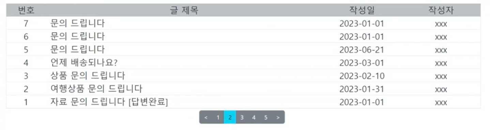
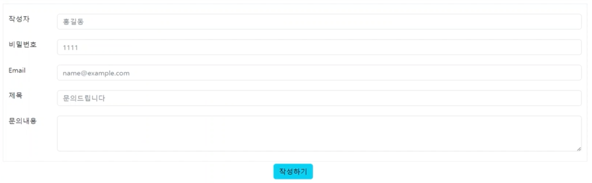
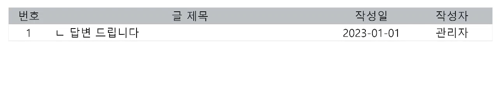
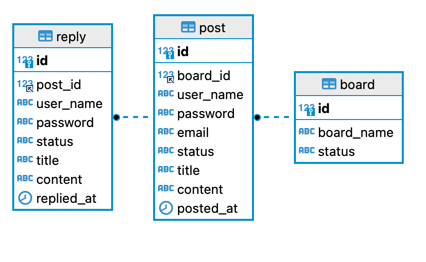
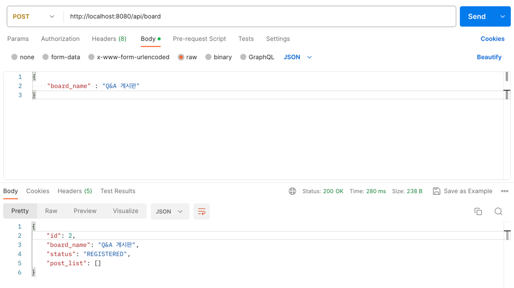
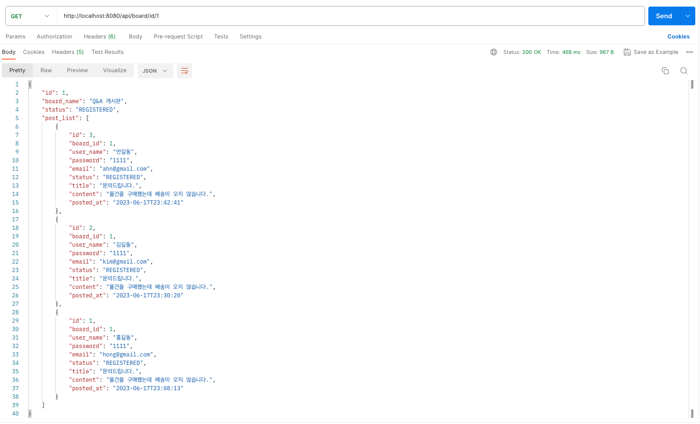
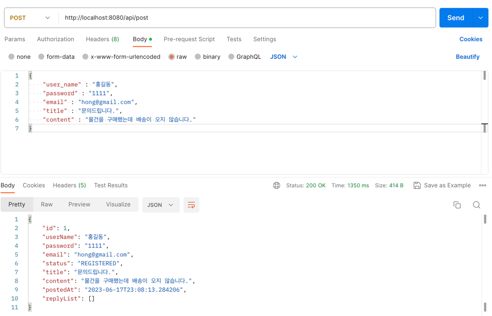
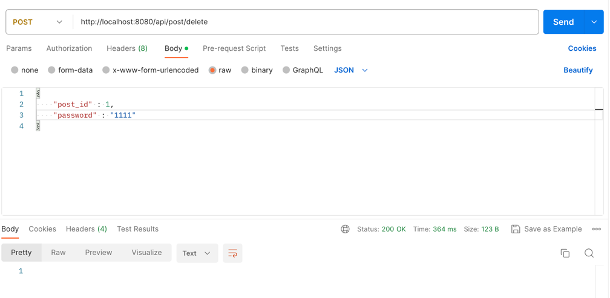
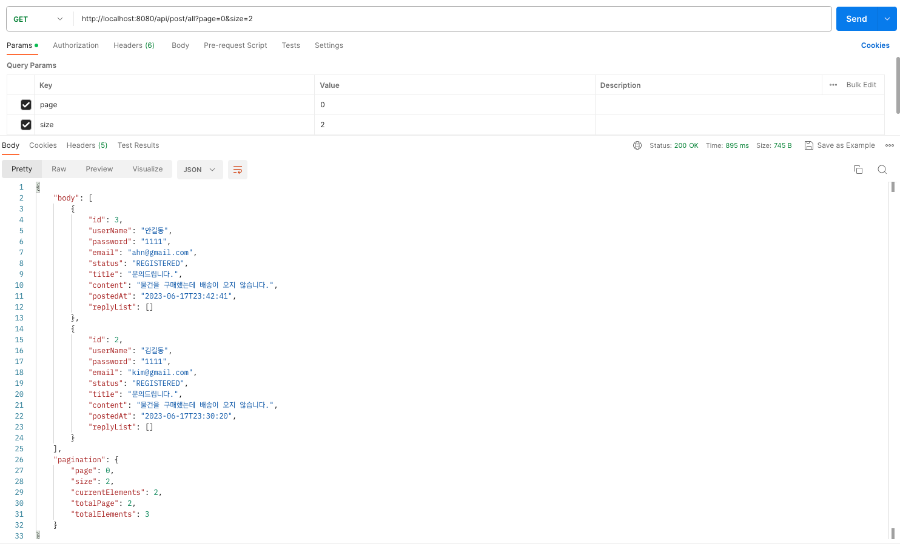
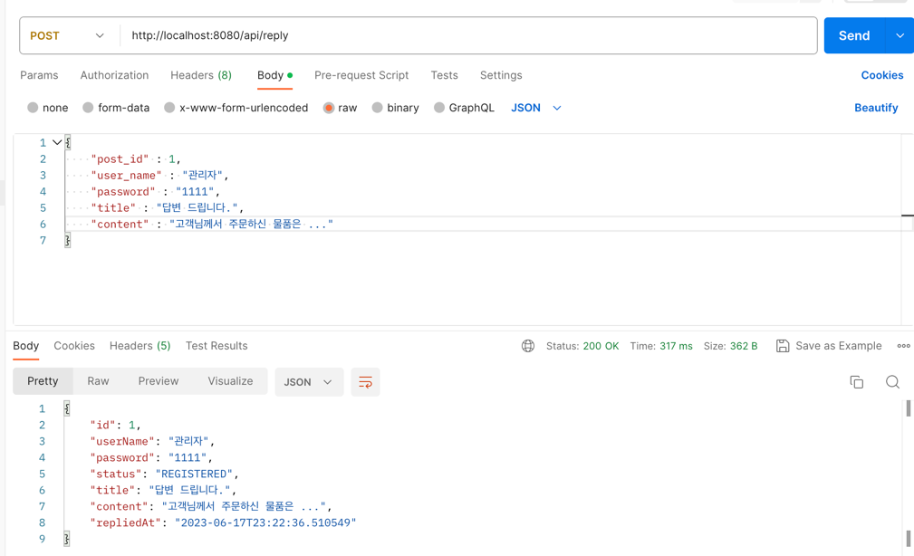

## 게시판 기능 구현 (API with JPA)
- API CRUD
- JPA
- pagination

---
### 1. 환경구축
- Language : Java 11
- Framework : Spring Boot 2.7.X
- DBMS : MySQL 8
- DB Library : JPA

### 2. 요구사항
- 목록 (글제목, 작성일, 작성자)

- 작성 ( 작성자, 비밀번호, 이메일, 핸드폰번호, 제목, 내용)

- 답변 (작성자, 비밀번호, 제목, 내용)

### 3. DB 설계

### 4. API
- 게시판 생성

- 게시판 조회

- 게시글 생성

- 게시글 열람

- 전체 게시글

- 답변 작성

